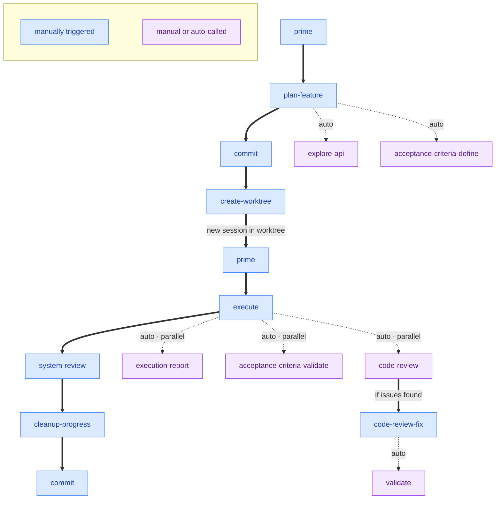

# ai-dev-env Workflow

```mermaid
flowchart TD
    classDef manual fill:#dbeafe,stroke:#3b82f6,color:#1e40af
    classDef mixed fill:#f3e8ff,stroke:#9333ea,color:#581c87

    subgraph leg[" "]
        direction LR
        lm[manually triggered]:::manual
        lb[manual or auto-called]:::mixed
        lm ~~~ lb
    end

    prime1[prime]:::manual
    plan_feature[plan-feature]:::manual
    commit1[commit]:::manual
    create_worktree[create-worktree]:::manual
    prime2[prime]:::manual
    execute[execute]:::manual
    system_review[system-review]:::manual
    cleanup_progress[cleanup-progress]:::manual
    commit2[commit]:::manual

    explore_api[explore-api]:::mixed
    ac_define[acceptance-criteria-define]:::mixed
    execution_report[execution-report]:::mixed
    ac_validate[acceptance-criteria-validate]:::mixed
    code_review[code-review]:::mixed
    code_review_fix[code-review-fix]:::manual
    validate[validate]:::mixed

    prime1 ==> plan_feature ==> commit1 ==> create_worktree ==>|"new session in worktree"| prime2 ==> execute ==> system_review ==> cleanup_progress ==> commit2

    plan_feature -.->|auto| explore_api
    plan_feature -.->|auto| ac_define

    execute -.->|"auto · parallel"| execution_report
    execute -.->|"auto · parallel"| ac_validate
    execute -.->|"auto · parallel"| code_review

    code_review ==>|"if issues found"| code_review_fix
    code_review_fix -.->|auto| validate
```
